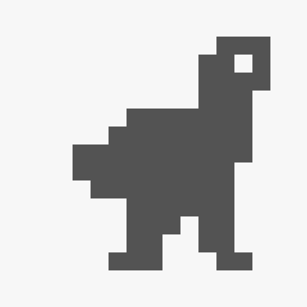

# Dino Runner 🦖

A faithful reimplementation of the **Chrome offline T-Rex Runner** game as a cross-platform desktop application built with Electron. Pure HTML/CSS/JavaScript game core, zero external assets (all sprites are string-defined pixel maps, all sound effects are synthesized via WebAudio).

> 一个使用 Electron 实现的跨平台桌面恐龙跑酷游戏，复刻 Chrome 断网页的小恐龙。游戏逻辑纯 HTML/CSS/JS，零外部素材（精灵由字符串点阵定义、音效用 WebAudio 实时合成）。



---

## ✨ 功能 / Features

- 高保真复刻 / Faithful reimplementation
  - 跳跃 / 下蹲（含短跳控制）
  - 仙人掌与翼龙两类障碍
  - 随分数逐渐加速 + 难度递增
  - 随机 1~3 株成丛仙人掌
  - 翼龙三种飞行高度
  - 日夜自动切换（每 300 分）
  - 顶部最高分记录 + 破纪录提示
- 增强 / Enhancements
  - 🔊 实时合成音效（跳跃 / 得分 / 撞击），可一键静音
  - ⏸ 暂停 / 继续（P / Esc）
  - 🔄 重新开始按钮 / 点击重开
  - ⭐ 夜空星点 + 月亮
  - 💾 通过主进程在 `userData/save.json` 持久化最高分，**清缓存也不丢**
  - 🖥 跨平台：Windows / macOS / Linux

---

## 🎮 操作 / Controls

| 按键 | 操作 |
|---|---|
| `Space` / `↑` / `W` / 点击 | 跳跃（待开始时 = 开始游戏） |
| `↓` / `S` | 下蹲（必须下蹲时，松开可恢复） |
| `P` / `Esc` | 暂停 / 继续 |
| `R` / `Enter` | 重新开始（结束后） |
| `M` | 静音开关（状态持久化） |
| `F11` | 切换全屏（Electron 默认行为） |

---

## 📦 安装 / Install

前往仓库的 [Releases 页面](https://github.com/looeton/dino-desktop/releases/latest) 下载对应平台安装包。

| 平台 | 文件 | 说明 |
|---|---|---|
| **Windows** x64 | `Dino-Runner-Setup-1.0.0.exe` | NSIS 安装器，可自选安装目录 |
| **macOS** Apple Silicon | `Dino-Runner-1.0.0-arm64.dmg` | M 系列芯片 |
| **macOS** Intel | `Dino-Runner-1.0.0.dmg` | x86_64 |
| **Linux** | `Dino-Runner-1.0.0.AppImage` | 免安装：`chmod +x` 后直接运行 |
| **Linux** Debian/Ubuntu | `dino-desktop_1.0.0_amd64.deb` | `sudo apt install ./dino-desktop_1.0.0_amd64.deb` |

每个安装包的 SHA-256 校验值可在 Release 页面查到。

> 仓库地址：[https://github.com/looeton/dino-desktop](https://github.com/looeton/dino-desktop)

Go to [Releases](https://github.com/looeton/dino-desktop/releases/latest) and grab the installer for your platform:

| Platform | File | Notes |
|---|---|---|
| **Windows** x64 | `Dino-Runner-Setup-1.0.0.exe` | NSIS installer, custom install dir supported |
| **macOS** Apple Silicon | `Dino-Runner-1.0.0-arm64.dmg` | M-series chips |
| **macOS** Intel | `Dino-Runner-1.0.0.dmg` | x86_64 |
| **Linux** | `Dino-Runner-1.0.0.AppImage` | Portable: `chmod +x` and run |
| **Linux** Debian/Ubuntu | `dino-desktop_1.0.0_amd64.deb` | `sudo apt install ./dino-desktop_1.0.0_amd64.deb` |

SHA-256 checksums for every asset are listed on the Release page.

---

## ⚠️ 未签名安装提示 / Unsigned Installer Note

应用未做代码签名（开发者没有 Apple 开发者证书和 Windows 代码签名证书），第一次运行会被系统拦截：

- **Windows**：SmartScreen 弹出「无法识别的应用」时点「仍要运行 / More info → Run anyway」
- **macOS**：双击 dmg 提示「无法验证开发者」时，右键点击 app →「打开 / Open」即可；或者在终端执行 `xattr -cr /Applications/Dino\ Runner.app`
- **Linux**：AppImage 无需签名；deb 需 `sudo dpkg -i ...` 或 `sudo apt install ./xxx.deb`

The application is **not code-signed** (no Apple Developer certificate / Windows code-signing cert). The first launch will be flagged by the OS:

- **Windows**: When SmartScreen shows "Windows protected your PC", click **More info → Run anyway**
- **macOS**: When macOS says the app "can't be opened because it is from an unidentified developer", right-click the app and choose **Open**; or run `xattr -cr /Applications/Dino\ Runner.app`
- **Linux**: AppImage needs no signing; `.deb` install with `sudo dpkg -i` or `sudo apt install ./xxx.deb`

---

## 🛠 本地运行与构建 / Build

依赖：Node.js ≥ 18（建议 22）。

Prerequisites: Node.js ≥ 18 (22 recommended).

```bash
# 克隆 / Clone
git clone https://github.com/looeton/dino-desktop.git
cd dino-desktop

# 安装依赖 / Install deps
npm install
# 如果 electron 二进制下载失败 / If the Electron binary download fails:
# ELECTRON_MIRROR=https://npmmirror.com/mirrors/electron/ npm install

# 直接运行（开发模式）/ Run the game directly
npm start

# 打包当前平台 / Package for current platform
npm run dist

# 单独打某个平台 / Build for a specific platform
npm run dist:win
npm run dist:mac
npm run dist:linux
```

产物输出到 `dist/`。Outputs go to `dist/`.

---

## 📁 项目结构 / Project Structure

```
dino-desktop/
├── main.js                 # Electron 主进程：窗口 + 持久化 IPC
├── preload.js              # preload 桥：暴露 dinoBridge 给渲染进程
├── package.json            # 脚本、依赖、electron-builder 三平台配置
├── build/                  # 应用图标（自动生成）
├── src/
│   ├── index.html
│   ├── css/style.css
│   └── js/
│       ├── sprites.js      # 全部精灵点阵（字符串定义，零图片资源）
│       ├── entities.js     # 恐龙 / 障碍 / 云 / 地面，含物理与 AABB 碰撞
│       ├── renderer.js     # Canvas 绘制 + 日夜配色 + 像素字体
│       ├── audio.js        # WebAudio 合成音效
│       ├── input.js        # 键盘 / 鼠标 / 触摸 → 语义动作
│       ├── storage.js      # 优先用主进程 IPC，缺则降级到 localStorage
│       └── game.js         # 状态机 + 主循环 + 难度调度 + 障碍生成
└── .github/workflows/build.yml
```

模块各司其职，单文件不超过 ~300 行，调试与改造都很轻松。每个文件顶部有详细的职责注释。

Modules are single-responsibility and capped at ~300 lines each — easy to read and modify. Every file has a top-of-file comment explaining what it does.

---

## 🧱 设计要点 / Design Notes

- **状态机**：`IDLE → RUNNING → (PAUSED) → OVER → RUNNING`（空格 / ↑ 重新开始）
- **主循环**：`requestAnimationFrame` + `dt` 时间步，单帧 `dt` 上限 50ms 防止后台切回时穿模
- **碰撞**：AABB 矩形相交，碰撞盒相对贴图略缩小（手感更宽容）
- **难度**：`speed = BASE * (1 + score / 700)`，封顶 760 px/s
- **昼夜**：`isNight = floor(score / 300) % 2`；夜间配色反转，并增加星星 + 月亮
- **持久化**：主进程写 `app.getPath('userData')/save.json`，渲染进程通过同步 IPC 读写；浏览器场景下降级到 `localStorage` → 内存

See comments at the top of each source file for details.

---

## 📄 许可 / License

MIT © looeton
